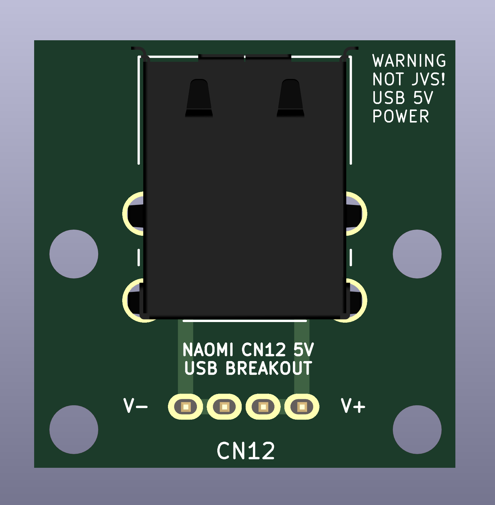

# naomi-5v-usb-breakout

Add 2 more vertical USB ports to your NAOMI 1/2 that provide +5V power to peripherals:

You can quick-order this board at [OSHPark](https://oshpark.com/shared_projects/ygh3cXod)
